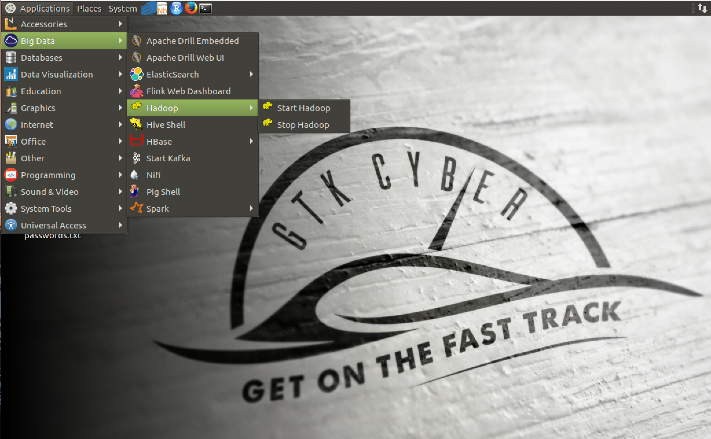
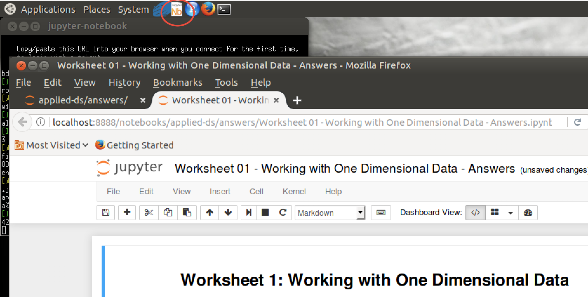
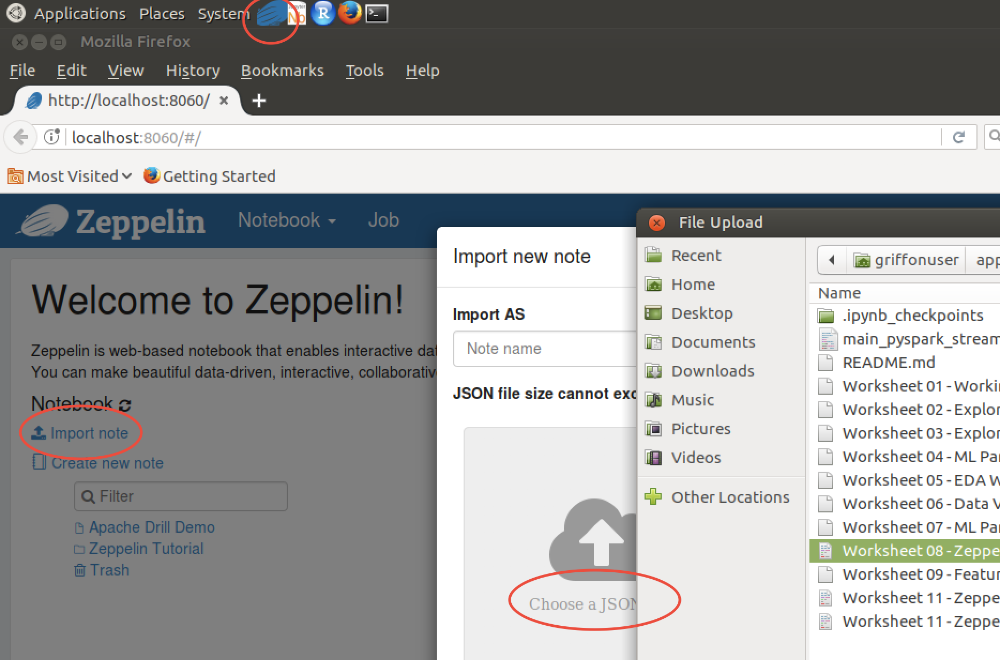
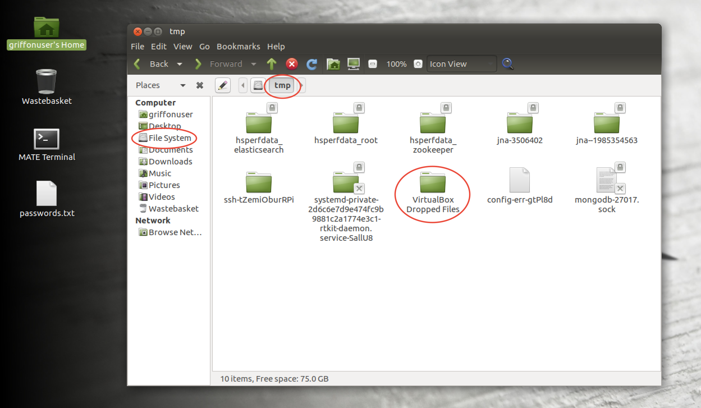

# Applied Data Science for Security Professionals


### Fall 2021 Virtual Trainings presented by GTK Cyber

GTK Cyber [www.gtkcyber.com](https://www.gtkcyber.com) was founded to bridge the gap between Data Science and Cyber Security and not
only provide high standard hands-on trainings, but introduce students to the most cutting-edge technologies and advancements in artificial intelligence,
all with a focus on direct applicability to cyber security.

### GRIFFON Data Science Virtual Machine

In order to have the best student experience, we strongly encourage you to download the Griffon VM here: https://github.com/gtkcyber/griffon-vm.
Griffon is a environment for data science. Griffon is based on Ubuntu MATE and includes numerous data science tools, all installed and configured for immediate use.



### Instructors

- Charles Givre - Data Scientist:  charles.givre@gtkcyber.com
- Curtis Lambert - Senior Instuctor: curtis@gtkcyber.com

### Lectures:

<a href="slides/">/Slides</a>
- Introduction
- Overview of Regular Expressions
- Exploratory Data Analysis in 1 Dimension
- Exploratory Data Analysis in 2 Dimensions
- Drilling Data
- Data Visualization
- Machine Learning (Feature Engineering)
- Machine Learning (Supervised)
- Machine Learning (Unsupervised)
- Anomaly Detection
- Hunting with Data Science
- Hacking Machine Learning Models


GitHub Structure

- answers (answers notebooks/solutions to all exercises and more)
- data (all data files)
- img (logo and screenshots)
- notebooks (all exercises)
- slides (all slides as pdf)

Development Environment


**Starting Jupyter notebook**: Go to Applications > Programming > Jupyter Notebook or hit the Nb icon located at the top menu bar. Navigate through your file system and open files with .ipynb extension.



**Starting Zeppelin notebook**: Go to Applications > Programming > Zeppelin > Start Zeppelin > open Mozilla web browser > http://localhost:8060/#/ or hit the Zeppelin icon (takes a while to start up) > import JSON to view notebook.



**Copy files into VM**: Drag and drop files or folders. You will find them under Filesystem > tmp > VirtualBox Dropped Files > subfolders ...




All exercises either as jupyter notebooks (.ipynb) or Zeppelin notebook (.json) are listed below.
Solutions to all challenges are within the ```answers``` folder (also contains additional notebooks and resources).  The worksheets are numbered so that the first number references the module and the second number refers to the position in the module.  For example, the second worksheet in module 1 is Worksheet 1.2.  

Notebooks/Scripts/Exercises and Data

- **notebooks/**
    - Worksheet 0.1 - Regular Expressions in Python.ipynb
    - Worksheet 1.1 - Working with One Dimensional Data.ipynb
    - Worksheet 1.2 - Exploring One Dimensional Data.ipynb
    - Worksheet 2.1 - Working with Two Dimensional Data.ipynb
    - Worksheet 2.2 - Exploratory Data Analysis.ipynb
    - Worksheet 3 - Working with Drill.ipynb
    - Worksheet 4 - Data Visualization.ipynb
    - Worksheet 5.1 - Feature Engineering.ipynb
    - Worksheet 5.2 - Malicious URL Classification .ipynb
    - Worksheet 5.3 - Tuning your Classifier.ipynb
    - Worksheet 5.4 - Automate it All!.ipynb
    - Worksheet 6.0 - Clustering.ipynb
    - Worksheet 7 - Anomaly Detection.ipynb
    - Worksheet 11 - Hunting with Data Science.ipynb

- **answers/**

    - Worksheet 0.1 - Regular Expressions in Python - Answers.ipynb
    - Worksheet 1.1 - Working with One Dimensional Data - Answers.ipynb
    - Worksheet 1.2 - Exploring One Dimensional Data - Answers.ipynb
    - Worksheet 2.1 - Exploring Two Dimensional Data - Answers.ipynb
    - Worksheet 2.2 - Exploratory Data Analysis - Answers.ipynb
    - Worksheet 3 - Working with Drill - Answers.ipynb
    - Worksheet 4 - Data Visualization - Answers.ipynb
    - Worksheet 5.1 - Feature Engineering - Answers.ipynb
    - Worksheet 5.2 - Malicious URL Classification - Answers.ipynb
    - Worksheet 5.3 - Tuning your Classifier - Answers.ipynb
    - Worksheet 5.4 - Automate it All! - Answers.ipynb
    - Worksheet 6.0 - Clustering - Answers.ipynb
    - Worksheet 7 - Anomaly Detection - Answers.ipynb
    - Worksheet 11 - Hunting with Data Science - Answers.ipynb

    
    
    BONUS notebooks:
    
    - Worksheet 08 - Zeppelin - PySpark Malicious URL ML Classification - Answers.json ```(open Zeppelin notebook and import JSON to view)```
    - Worksheet 09 - Featureless Deep Learning URL - Answers.ipynb
    - Worksheet 11 - Zeppelin Part1 - PySpark + ELK + Kafka - Answers.json ```(open Zeppelin notebook and import JSON to view)```
    - Worksheet 11 - Zeppelin Part2 - PySpark + ELK + Kafka -Answers.json ```(open Zeppelin notebook and import JSON to view)```
    - main_pyspark_streaming_apachelogs_kafka.py (complementing Worksheet 11 - Zeppelin Part2)

- recommended readings

    - [Python for Data Analysis](http://shop.oreilly.com/product/0636920023784.do)
    - [Data Science for Business](http://shop.oreilly.com/product/0636920028918.do)
    - [Creating a Data-Driven Organization](http://shop.oreilly.com/product/0636920035848.do)
    - [Data-Driven Security](http://datadrivensecurity.info/)
    - [Mastering Machine Learning with scikit-learn](https://www.packtpub.com/big-data-and-business-intelligence/mastering-machine-learning-scikit-learn)
    - [Hands-On Machine Learning with Scikit-Learn and TensorFlow](http://shop.oreilly.com/product/0636920052289.do)
    - [Learning Apache Drill](https://amzn.to/2M8Peo6)
    - [Deep Learning](http://www.deeplearningbook.org/)
    
- **data/**

    - access
    - apache-access.log
    - CountVectorizer_domains.pickle (pickled ML Feature Engineering models)
    - CountVectorizer_paths.pickle
    - CountVectorizer_tlds.pickle
    - dailybots.csv
    - data1.json
    - data2.json
    - data3.json
    - data4.json
    - deeplearning_1DConv.h5 (saved Deep Learning URL Classification keras models)
    - deeplearning_1DConv.json
    - deeplearning_1DConvLSTM.h5
    - deeplearning_1DConvLSTM.json
    - deeplearning_LSTM.h5
    - deeplearning_LSTM.json
    - dga_data_full.csv (extra Domain Generation Algorithms data set)
    - dga_data_small.csv
    - dns_messages.log
    - domains_created_db.csv (database of whois creation time for unique domains)
    - eve.json (nested json file)
    - eve_small.json
    - feature_names.pickle (pickled ML Feature Engineering column names)
    - hackers-access.httpd
    - http.pcap
    - http-pcap.json
    - large_eve_json.zip
    - maccdc2012_00000.csv.gz (pcap for pyspark)
    - maccdc2012_00000.pcap.gz
    - maccdc2012_00000_small.csv.gz
    - maccdc2012_00000_small.csv
    - maccdc2012_00000_small.pcap.gz
    - mysql.log
    - snort
    - telnet-cooked.pcap
    - url_data_full.csv (raw Machine Learning URL Classification data set)
    - url_data_medium.csv
    - url_data_mega_deep_learning.csv (more raw URLs for Deep Learning without whois info)
    - url_data_small.csv
    - url_features_final_df.csv (clean feature matrix Machine Learning URL Classification)
    - url_features_final_df_spark.csv (for Spark version no periods in column names)
